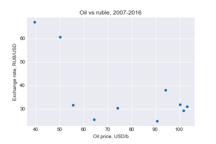

#Todo:
- unit of description for illustration - "one pager" with URL
- indicator pae
- theme page

#Not todo:
- error.html

##Project outline

##Unit of diplay


--------------------------------

```
1. Source+ETL+naming = "Dataset/database"


2. Graphics + Hosting = View


3. Concept, idea, motivation = "User Сase"

```
## Data
- many targets to download data from Rossta and CB

## Graphics
- Unit of display: graph + comment.

## Hosting
- <https://datachart.cc.s3-eu-west-1.amazonaws.com/>
- or similar to "одноклассники" at Heroku/Elastic BeansTalk
- Jekyll at github-pages with redirect

## User case

- Obtain comment on most recent statistics: 
 - latest values
 - detrended data
 - forecast
 
- Make decisions on:
  - fx forecast 
  - are we in or out of recession
  - what parts of economy are moving what direction
  - how larger economy affects specific businesses
  - broad "what to expect"?

- Download csv

- Check popular statistics 

## 
## 

# Plotting

### Sample: scatter plot visualisation using matplotlib.

Excel:


Matplotlib/pandas with Seaborn theme:



See also [IPython notebook](rub_oil.ipynb)

### More plotting examples: 
- <https://github.com/epogrebnyak/plotting>
- <https://github.com/epogrebnyak/data-rosstat-kep/blob/master/kep/getter/plots.py>
- <https://github.com/epogrebnyak/testbed-ipython-notebook>
